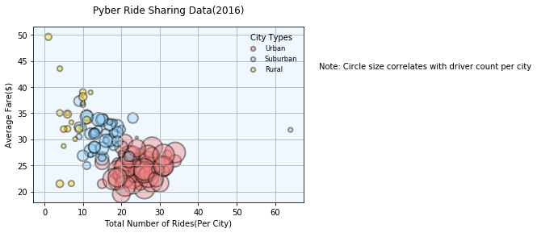
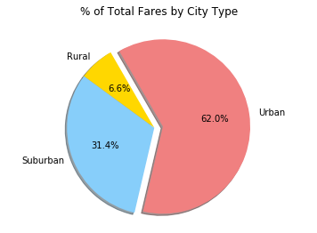
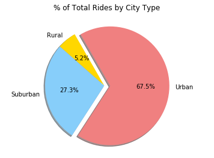
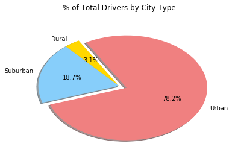

# Pyber Ride Sharing

Trend 1 Urban cities has more drivers compare to suburban and rural

Trend 2 Average fare are less expensive in urban cities

Trend 3 More people use Pyber Ride Sharing service in urban cities

# Part I Bubble Chart


```python
# Import Pandas module
import pandas as pd
import matplotlib.pyplot as plt
import numpy as np

# load CSV
city = "city_data.csv"
ride = "ride_data.csv"
```


```python
# Read with pandas--low_memory required to suppress errors about mixed data types
city_pd = pd.read_csv(city, encoding='iso-8859-1', low_memory=False)
```


```python
# Read with pandas--low_memory required to suppress errors about mixed data types/student csv
ride_pd= pd.read_csv(ride, encoding='iso-8859-1', low_memory=False)
```


```python
# Performing an inner merge on the two dataframes, using the "city" field
data_merge_df = pd.merge(city_pd, ride_pd, on="city")
data_merge_df.head()
```


<div>
<style>
    .dataframe thead tr:only-child th {
        text-align: right;
    }

    .dataframe thead th {
        text-align: left;
    }

    .dataframe tbody tr th {
        vertical-align: top;
    }
</style>
<table border="1" class="dataframe">
  <thead>
    <tr style="text-align: right;">
      <th></th>
      <th>city</th>
      <th>driver_count</th>
      <th>type</th>
      <th>date</th>
      <th>fare</th>
      <th>ride_id</th>
    </tr>
  </thead>
  <tbody>
    <tr>
      <th>0</th>
      <td>Kelseyland</td>
      <td>63</td>
      <td>Urban</td>
      <td>2016-08-19 04:27:52</td>
      <td>5.51</td>
      <td>6246006544795</td>
    </tr>
    <tr>
      <th>1</th>
      <td>Kelseyland</td>
      <td>63</td>
      <td>Urban</td>
      <td>2016-04-17 06:59:50</td>
      <td>5.54</td>
      <td>7466473222333</td>
    </tr>
    <tr>
      <th>2</th>
      <td>Kelseyland</td>
      <td>63</td>
      <td>Urban</td>
      <td>2016-05-04 15:06:07</td>
      <td>30.54</td>
      <td>2140501382736</td>
    </tr>
    <tr>
      <th>3</th>
      <td>Kelseyland</td>
      <td>63</td>
      <td>Urban</td>
      <td>2016-01-25 20:44:56</td>
      <td>12.08</td>
      <td>1896987891309</td>
    </tr>
    <tr>
      <th>4</th>
      <td>Kelseyland</td>
      <td>63</td>
      <td>Urban</td>
      <td>2016-08-09 18:19:47</td>
      <td>17.91</td>
      <td>8784212854829</td>
    </tr>
  </tbody>
</table>
</div>


```python
# remove duplicates
citydata_df=data_merge_df.drop_duplicates(['city'], keep='last')
```


```python
# reset index
cityride_df=citydata_df.reset_index(drop=True)
```


```python
# Average Fare ($) Per City
city_data= data_merge_df.groupby("city")
avg_fare = pd.DataFrame(city_data["fare"].mean())
avg1=avg_fare.reset_index()
```


```python
# Total Number of Rides Per City
city_data= data_merge_df.groupby("city")
num_ride = pd.DataFrame(city_data["ride_id"].count())
numride1=num_ride.reset_index()
```


```python
# Total Number of Drivers Per City
driver_count=cityride_df.iloc[:,0:3]
```


```python
#merge table
total1_merge_df = pd.merge(avg1, numride1, on="city")
```


```python
#merge table
total2_merge_df = pd.merge(total1_merge_df, driver_count, on="city")
```


```python
#rename
final_df = total2_merge_df.rename(columns={"city":"City",
                                       "fare":"Avg Fare",
                                       "ride_id":"Num of Rides",
                                       "driver_count":"Num of Drivers",
                                       "type":"City Type"})
final_df.head()
```


<div>
<style>
    .dataframe thead tr:only-child th {
        text-align: right;
    }

    .dataframe thead th {
        text-align: left;
    }

    .dataframe tbody tr th {
        vertical-align: top;
    }
</style>
<table border="1" class="dataframe">
  <thead>
    <tr style="text-align: right;">
      <th></th>
      <th>City</th>
      <th>Avg Fare</th>
      <th>Num of Rides</th>
      <th>Num of Drivers</th>
      <th>City Type</th>
    </tr>
  </thead>
  <tbody>
    <tr>
      <th>0</th>
      <td>Alvarezhaven</td>
      <td>23.928710</td>
      <td>31</td>
      <td>21</td>
      <td>Urban</td>
    </tr>
    <tr>
      <th>1</th>
      <td>Alyssaberg</td>
      <td>20.609615</td>
      <td>26</td>
      <td>67</td>
      <td>Urban</td>
    </tr>
    <tr>
      <th>2</th>
      <td>Anitamouth</td>
      <td>37.315556</td>
      <td>9</td>
      <td>16</td>
      <td>Suburban</td>
    </tr>
    <tr>
      <th>3</th>
      <td>Antoniomouth</td>
      <td>23.625000</td>
      <td>22</td>
      <td>21</td>
      <td>Urban</td>
    </tr>
    <tr>
      <th>4</th>
      <td>Aprilchester</td>
      <td>21.981579</td>
      <td>19</td>
      <td>49</td>
      <td>Urban</td>
    </tr>
  </tbody>
</table>
</div>


```python
#show city type
City_Type = "Urban"
urban_df = final_df.loc[final_df["City Type"] == City_Type]
urban_df.sort_values(by='Num of Rides', ascending=0).head()
```


<div>
<style>
    .dataframe thead tr:only-child th {
        text-align: right;
    }

    .dataframe thead th {
        text-align: left;
    }

    .dataframe tbody tr th {
        vertical-align: top;
    }
</style>
<table border="1" class="dataframe">
  <thead>
    <tr style="text-align: right;">
      <th></th>
      <th>City</th>
      <th>Avg Fare</th>
      <th>Num of Rides</th>
      <th>Num of Drivers</th>
      <th>City Type</th>
    </tr>
  </thead>
  <tbody>
    <tr>
      <th>73</th>
      <td>Port Johnstad</td>
      <td>25.882941</td>
      <td>34</td>
      <td>22</td>
      <td>Urban</td>
    </tr>
    <tr>
      <th>100</th>
      <td>Swansonbury</td>
      <td>27.464706</td>
      <td>34</td>
      <td>64</td>
      <td>Urban</td>
    </tr>
    <tr>
      <th>94</th>
      <td>South Louis</td>
      <td>27.087500</td>
      <td>32</td>
      <td>12</td>
      <td>Urban</td>
    </tr>
    <tr>
      <th>28</th>
      <td>Jacobfort</td>
      <td>24.779355</td>
      <td>31</td>
      <td>52</td>
      <td>Urban</td>
    </tr>
    <tr>
      <th>0</th>
      <td>Alvarezhaven</td>
      <td>23.928710</td>
      <td>31</td>
      <td>21</td>
      <td>Urban</td>
    </tr>
  </tbody>
</table>
</div>


```python
#show city type
City_Type = "Suburban"
sub_df = final_df.loc[final_df["City Type"] == City_Type]
sub_df.sort_values(by='Num of Rides', ascending=0).head()
```


<div>
<style>
    .dataframe thead tr:only-child th {
        text-align: right;
    }

    .dataframe thead th {
        text-align: left;
    }

    .dataframe tbody tr th {
        vertical-align: top;
    }
</style>
<table border="1" class="dataframe">
  <thead>
    <tr style="text-align: right;">
      <th></th>
      <th>City</th>
      <th>Avg Fare</th>
      <th>Num of Rides</th>
      <th>Num of Drivers</th>
      <th>City Type</th>
    </tr>
  </thead>
  <tbody>
    <tr>
      <th>72</th>
      <td>Port James</td>
      <td>31.806562</td>
      <td>64</td>
      <td>3</td>
      <td>Suburban</td>
    </tr>
    <tr>
      <th>101</th>
      <td>Thomastown</td>
      <td>30.308333</td>
      <td>24</td>
      <td>1</td>
      <td>Suburban</td>
    </tr>
    <tr>
      <th>62</th>
      <td>New Samanthaside</td>
      <td>34.069130</td>
      <td>23</td>
      <td>16</td>
      <td>Suburban</td>
    </tr>
    <tr>
      <th>77</th>
      <td>Port Michelleview</td>
      <td>26.720000</td>
      <td>22</td>
      <td>16</td>
      <td>Suburban</td>
    </tr>
    <tr>
      <th>81</th>
      <td>Rodriguezview</td>
      <td>31.866500</td>
      <td>20</td>
      <td>10</td>
      <td>Suburban</td>
    </tr>
  </tbody>
</table>
</div>


```python
#show city type
City_Type = "Rural"
rural_df = final_df.loc[final_df["City Type"] == City_Type]
rural_df.sort_values(by='Num of Rides', ascending=0).head()
```


<div>
<style>
    .dataframe thead tr:only-child th {
        text-align: right;
    }

    .dataframe thead th {
        text-align: left;
    }

    .dataframe tbody tr th {
        vertical-align: top;
    }
</style>
<table border="1" class="dataframe">
  <thead>
    <tr style="text-align: right;">
      <th></th>
      <th>City</th>
      <th>Avg Fare</th>
      <th>Num of Rides</th>
      <th>Num of Drivers</th>
      <th>City Type</th>
    </tr>
  </thead>
  <tbody>
    <tr>
      <th>92</th>
      <td>South Joseph</td>
      <td>38.983333</td>
      <td>12</td>
      <td>3</td>
      <td>Rural</td>
    </tr>
    <tr>
      <th>17</th>
      <td>East Leslie</td>
      <td>33.660909</td>
      <td>11</td>
      <td>9</td>
      <td>Rural</td>
    </tr>
    <tr>
      <th>34</th>
      <td>Kennethburgh</td>
      <td>36.928000</td>
      <td>10</td>
      <td>3</td>
      <td>Rural</td>
    </tr>
    <tr>
      <th>66</th>
      <td>North Whitney</td>
      <td>38.146000</td>
      <td>10</td>
      <td>10</td>
      <td>Rural</td>
    </tr>
    <tr>
      <th>18</th>
      <td>East Stephen</td>
      <td>39.053000</td>
      <td>10</td>
      <td>6</td>
      <td>Rural</td>
    </tr>
  </tbody>
</table>
</div>


```python
# create data
x1 = urban_df["Num of Rides"]
y1 = urban_df["Avg Fare"]
z1 = urban_df["Num of Drivers"]
x2 = sub_df["Num of Rides"]
y2 = sub_df["Avg Fare"]
z2 = sub_df["Num of Drivers"]
x3 = rural_df["Num of Rides"]
y3 = rural_df["Avg Fare"]
z3 = rural_df["Num of Drivers"]


# use the scatter function
plt.scatter(x1, y1, s=z1*10, color="lightcoral", edgecolors="black", marker="o", linewidth= 2, alpha=0.4, label='Urban')
plt.scatter(x2, y2, s=z2*10, color="lightskyblue", edgecolors="black", marker="o", linewidth= 2, alpha=0.4,label='Suburban')
plt.scatter(x3, y3, s=z3*10, color="gold", edgecolors="black", marker="o", linewidth= 2, alpha=0.4,label='Rural')
plt.xlabel('Total Number of Rides(Per City)')
plt.ylabel('Average Fare($)')
plt.title('Pyber Ride Sharing Data(2016)',y=1.05)
plt.rcParams['axes.facecolor'] = 'aliceblue'
plt.grid(True)
lgnd=plt.legend(loc="best", frameon=False, title="City Types", fontsize='small')
lgnd.legendHandles[0]._sizes = [30]
lgnd.legendHandles[1]._sizes = [30]
lgnd.legendHandles[2]._sizes = [30]
plt.figtext(1.25, 0.7,"Note: Circle size correlates with driver count per city", wrap=True,
            horizontalalignment='center', fontsize=10)
plt.show()
```





# Part II Pie Chart


```python
# % of Total Fares by City Type
city_fare=data_merge_df.groupby("type")
city_f = pd.DataFrame(city_fare["fare"].sum())
city_f
```


<div>
<style>
    .dataframe thead tr:only-child th {
        text-align: right;
    }

    .dataframe thead th {
        text-align: left;
    }

    .dataframe tbody tr th {
        vertical-align: top;
    }
</style>
<table border="1" class="dataframe">
  <thead>
    <tr style="text-align: right;">
      <th></th>
      <th>fare</th>
    </tr>
    <tr>
      <th>type</th>
      <th></th>
    </tr>
  </thead>
  <tbody>
    <tr>
      <th>Rural</th>
      <td>4255.09</td>
    </tr>
    <tr>
      <th>Suburban</th>
      <td>20335.69</td>
    </tr>
    <tr>
      <th>Urban</th>
      <td>40078.34</td>
    </tr>
  </tbody>
</table>
</div>


```python
#total fare
total_fare = city_f["fare"].sum()
total_fare
```


    64669.119999999966


```python
# calculate % of total fare by city type
city_f["% of Total Fares by City Type"] = city_f["fare"]/total_fare * 100
city_f
```


<div>
<style>
    .dataframe thead tr:only-child th {
        text-align: right;
    }

    .dataframe thead th {
        text-align: left;
    }

    .dataframe tbody tr th {
        vertical-align: top;
    }
</style>
<table border="1" class="dataframe">
  <thead>
    <tr style="text-align: right;">
      <th></th>
      <th>fare</th>
      <th>% of Total Fares by City Type</th>
    </tr>
    <tr>
      <th>type</th>
      <th></th>
      <th></th>
    </tr>
  </thead>
  <tbody>
    <tr>
      <th>Rural</th>
      <td>4255.09</td>
      <td>6.579786</td>
    </tr>
    <tr>
      <th>Suburban</th>
      <td>20335.69</td>
      <td>31.445750</td>
    </tr>
    <tr>
      <th>Urban</th>
      <td>40078.34</td>
      <td>61.974463</td>
    </tr>
  </tbody>
</table>
</div>


# Total Fares by City Type


```python
# Pie Chart
city_type = ["Rural", "Suburban", "Urban"]
city_fare = city_f["fare"]
colors = ["gold", "lightskyblue","lightcoral"]
explode = [0.0,0.0,0.1]
plt.pie(city_fare, explode=explode, labels=city_type, colors=colors,
        autopct="%1.1f%%", shadow=True, startangle=120)
plt.title('% of Total Fares by City Type',y=1.05)
plt.axis("equal")
plt.show()
```





```python
# % of Total Rides by City Type
city_rides=data_merge_df.groupby("type")
city_r = pd.DataFrame(city_rides["ride_id"].count())
```


```python
#total ride
total_ride = data_merge_df["ride_id"].count()
```


```python
# calculate % of total ride by city type
city_r["% of Total Rides by City Type"] = city_r["ride_id"]/total_ride * 100
city_r
```


<div>
<style>
    .dataframe thead tr:only-child th {
        text-align: right;
    }

    .dataframe thead th {
        text-align: left;
    }

    .dataframe tbody tr th {
        vertical-align: top;
    }
</style>
<table border="1" class="dataframe">
  <thead>
    <tr style="text-align: right;">
      <th></th>
      <th>ride_id</th>
      <th>% of Total Rides by City Type</th>
    </tr>
    <tr>
      <th>type</th>
      <th></th>
      <th></th>
    </tr>
  </thead>
  <tbody>
    <tr>
      <th>Rural</th>
      <td>125</td>
      <td>5.193187</td>
    </tr>
    <tr>
      <th>Suburban</th>
      <td>657</td>
      <td>27.295388</td>
    </tr>
    <tr>
      <th>Urban</th>
      <td>1625</td>
      <td>67.511425</td>
    </tr>
  </tbody>
</table>
</div>


# Total Rides by City Type


```python
# Pie Chart
city_type = ["Rural", "Suburban", "Urban"]
city_ride = city_r["ride_id"]
colors = ["gold", "lightskyblue","lightcoral"]
explode = [0.0,0.0,0.1]
plt.pie(city_ride, explode=explode, labels=city_type, colors=colors,
        autopct="%1.1f%%", shadow=True, startangle=120)
plt.title('% of Total Rides by City Type',y=1.05)
plt.axis("equal")
plt.show()
```





```python
# % of Total Drivers by City Type
city_driver=driver_count.groupby("type")
city_dc = pd.DataFrame(city_driver["driver_count"].sum())
```


```python
#total driver
total_dc = driver_count["driver_count"].sum()
```


```python
# calculate % of total driver by city type
city_dc["% of Total Drivers by City Type"] = city_dc["driver_count"]/total_dc * 100
city_dc
```


<div>
<style>
    .dataframe thead tr:only-child th {
        text-align: right;
    }

    .dataframe thead th {
        text-align: left;
    }

    .dataframe tbody tr th {
        vertical-align: top;
    }
</style>
<table border="1" class="dataframe">
  <thead>
    <tr style="text-align: right;">
      <th></th>
      <th>driver_count</th>
      <th>% of Total Drivers by City Type</th>
    </tr>
    <tr>
      <th>type</th>
      <th></th>
      <th></th>
    </tr>
  </thead>
  <tbody>
    <tr>
      <th>Rural</th>
      <td>104</td>
      <td>3.119376</td>
    </tr>
    <tr>
      <th>Suburban</th>
      <td>623</td>
      <td>18.686263</td>
    </tr>
    <tr>
      <th>Urban</th>
      <td>2607</td>
      <td>78.194361</td>
    </tr>
  </tbody>
</table>
</div>


# Total Drivers by City Type


```python
# Pie Chart
city_type = ["Rural", "Suburban", "Urban"]
city_driver = city_dc["driver_count"]
colors = ["gold", "lightskyblue","lightcoral"]
explode = [0.0,0.0,0.1]
plt.pie(city_driver, explode=explode, labels=city_type, colors=colors,
        autopct="%1.1f%%", shadow=True, startangle=120)
plt.title('% of Total Drivers by City Type',y=1.05)

plt.show()
```




